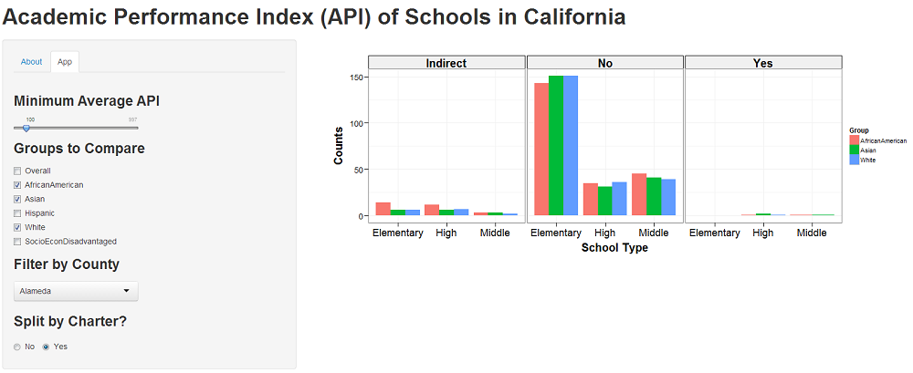

# Coursera: Developing Data Products Course Project

This peer assessed assignment has two parts. First, there is a Shiny application that is deployed on Rstudio's servers. Second, there is a Slidify presentation about the application.

## Shiny Application

The Shiny application compares the Academic Performance Index (API) of Schools in California subject to a number of variable (input) conditions. App published from RStudio to ShinyApps.io [here](http://pacificprince.shinyapps.io/Shiny/).

### Goal

The goal of this project was to write an Shiny application that demonstrate's some of Shiny's features. Calculations from operations on ui.R are displayed as reactive output on server.R.

### Dataset

- *The cornerstone of California's Public Schools Accountability Act of 1999; measures the academic performance and growth of schools on a variety of academic measures* ([site](http://www.cde.ca.gov/ta/ac/)), one of which is the *Academic Performance Index (API)*. 

- The dataset used in the Shiny application is the API for public schools in California compiled from 2011 - 2013 and can be found [here](http://www.cde.ca.gov/ta/ac/ap/apidatafiles.asp). The corresponding codebook for this datasoure can be found [here](http://www.cde.ca.gov/ta/ac/ap/reclayoutApiAvg.asp) or in the `codebook.md` file in this repo. 

- Of particular focus in the UI is the breakdown of the three year weighted API average by race, county and charter funded schools.

### Interface

The interface to the Shiny application is shown in the figure below. The application allows for quickly viewing and comparing APIs by race, county and charter funding. The left side contains input controls (user selection). The output on the right is a bar plot comparing the three year weighted average API as per the selections.

The user input section consists of the following controls:

- **Minimum Average API**: A slider control for selecting the minimum average API to consider. Values below this are ignored/filtered.

- **Groups to Compare**: Checkboxes to select groups to compare. Multiple groups can be selected at the same time.

- **Filter by County**: Drop down list containing various counties in CA across which the comparison is desired.

- **Split by Charter**: Radio buttons to determine if output plot should be split by schools according to charter funding.

Based on these user inputs the API is calculated and filtered by `server.R` and displayed as a (reactive) barplot.

## Slidify: Reproducible Pitch Presentation

The slidify presentation is available at [here](http://pacificprince.github.io/DevDataProdProj/presentation.html).

